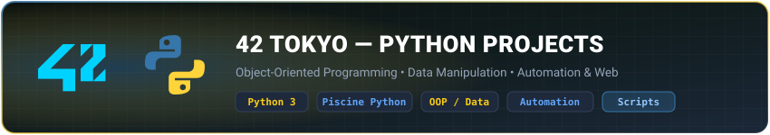
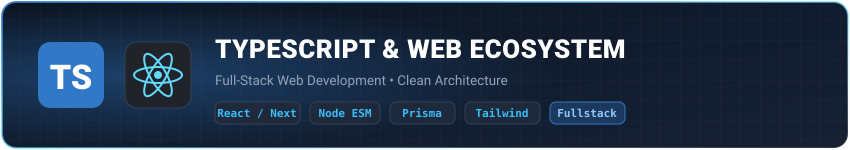

<div align="center">

# 👋 Hi there, I'm Javier (`@peladno`)

### 🎓 42 Tokyo Student &nbsp;|&nbsp; 💻 Full-Stack &amp; Systems Developer

**Bridging modern web architectures with low-level systems programming**

<p align="center">
  <a href="https://portfolio.j-perezurrutia.workers.dev" target="_blank">
    
  </a>
  <a href="https://linkedin.com/in/javier-perez-u" target="_blank">
    
  </a>
  <a href="mailto:j.perezurrutia@gmail.com">
    
  </a>
  <a href="https://instagram.com/pelad.no" target="_blank">
    
  </a>
</p>

---

</div>

## 💫 About Me

- 🏫 **42 Tokyo Student**: Deep diving into the 42 curriculum with rigorous peer-to-peer evaluations and strict norm compliance.
- 🔭 **Backend & Fullstack**: Building clean, maintainable web apps using **TypeScript, Node.js (ESM), Express, Prisma, and Docker**.
- 🌱 **Systems & Low-Level**: Mastering **C** fundamentals (pointers, dynamic memory management, Unix file descriptors, POSIX).
- 🚀 **Currently Exploring**: **Go (Golang)** for high-throughput concurrent microservices and tooling.
- 👀 **Outside of Code**: Passionate about photography 📸, discovering gastronomy & food spots 🍜, and bicycles 🚲.

---

## 🗂️ Categories by Language & Ecosystem

### ⚡ 42 School — C Programming

<p align="center">
  <a href="https://github.com/stars/peladno/lists/42c">
    
  </a>
</p>

> **Core Focus:** Unix system calls, memory management (`malloc`/`free`), pointer manipulation, algorithm optimization (`push_swap`), and custom re-implementations of standard library utilities (`libft`, `ft_printf`, `get_next_line`).

```c
/* Low-level mastery & strictly compliant with 42 Norminette */
typedef struct s_developer {
    char    *name;      /* "Javier" */
    char    *school;    /* "42 Tokyo" */
    char    *status;    /* "Pointers & Algorithms" */
}   t_dev;
```

---

### 🐍 42 School — Python

<p align="center">
  <a href="https://github.com/stars/peladno/lists/42python">
    
  </a>
</p>

> **Core Focus:** Object-Oriented Programming, clean scripting, data manipulation, automation, and full-stack integration with Python 3.

```python
class Developer:
    def __init__(self):
        self.name = "Javier"
        self.school = "42 Tokyo"
        self.skills = ["OOP", "Data Structures", "Automation", "REST APIs"]
```

---

### 🌐 TypeScript & Web Ecosystem

<p align="center">
  <a href="https://github.com/stars/peladno/lists/ts-and-js">
    
  </a>
</p>

> **Core Focus:** Modern reactive user interfaces, clean modular architectures, type-safe database ORM integrations, and reproducible fullstack environments.

---

### 🟢 Node.js & Backend Architecture

<p align="center">
  <a href="https://github.com/stars/peladno/lists/node-js">
    
  </a>
</p>

> **Core Focus:** ESM-based architecture, RESTful API design with Express, Prisma ORM schema modeling, PostgreSQL, and scalable microservices.

---

<!-- ### 🚀 Go & Backend Systems

<p align="center">
  <a href="https://github.com/peladno?tab=repositories&q=go">
    
  </a>
</p>

> **Core Focus:** High-performance RESTful APIs, concurrent pipelines, containerization with Docker, and scalable microservices.

--- -->

## 🛠️ Comprehensive Tech Stack

| Domain                 | Technologies &amp; Tools                                                                                                                                                                                                                                                                                                                                                                                                                                                                                                                                                                                                                                                                                                                                                                                                                                      |
| :--------------------- | :------------------------------------------------------------------------------------------------------------------------------------------------------------------------------------------------------------------------------------------------------------------------------------------------------------------------------------------------------------------------------------------------------------------------------------------------------------------------------------------------------------------------------------------------------------------------------------------------------------------------------------------------------------------------------------------------------------------------------------------------------------------------------------------------------------------------------------------------------------ |
| **Languages**          |                                                                                                                                                                                                                                         |
| **Frontend**           |                                                                                                                   |
| **Backend &amp; DB**   |         |
| **DevOps &amp; Tools** |                                                                                                                                                                                                                                                            |

---

## 📊 GitHub Analytics

<div align="center">
  <table border="0">
    <tr>
      <td>
        
      </td>
      <td>
        
      </td>
    </tr>
    <tr>
      <td colspan="2" align="center">
        
      </td>
    </tr>
  </table>
</div>

---

<div align="center">

### ✍️ Daily Inspiration


[](https://visitcount.itsvg.in)

</div>
